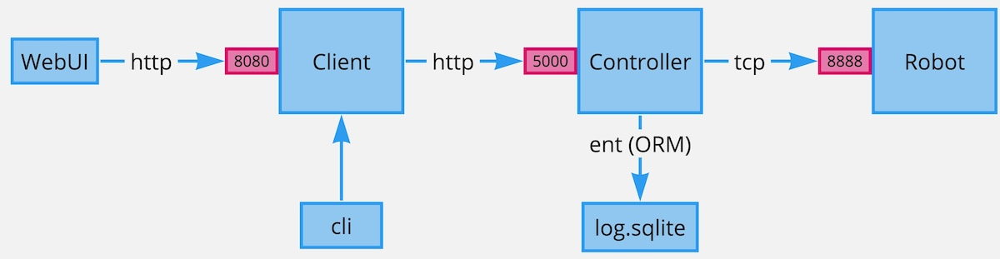

# Architecture



# Project Structure

```
.
├── api
│   ├── client.go
│   ├── commands.go
│   └── massage.go
├── cmd
│   ├── client
│   ├── controller
│   └── simulated_robot
├── configs
│   ├── config.go
│   └── config.yml
├── ent
│   ├── schema               <== database schema
├── internal
│   ├── client
│   ├── controller
│   └── robot
├── Dockerfile.client
├── Dockerfile.controller
├── Dockerfile.robot
├── Makefile
├── README.md
├── config.yml               <== config file for docker build
├── docker-compose.yaml
└── log.sqlite               <== sqlite database file
```

# Requirements

- Docker

- docker-compose

- golang 1.23.1 (to run code locally)

- make

# Quick Start (Docker)

Run a command from the project root folder:

```shell
make up
```

Open Client's WebUI in browser:

```
http://localhost:8080
```

# Run application manually

### Robot application

```shell
go run ./cmd/simulated_robot/
```

### Controller application

Start Controller:

```shell
go run ./cmd/controller/
```

If the database schema must be created or updated:

```shell
make db
```

### Client application

To Send a command to the Controller:

```shell
go run ./cmd/client/ instruction start
```

To run Client Shell (interactive mode):

```shell
go run ./cmd/client/ shell            
> client 
          exit         Exit the interactive shell.                                      
          help         Help about any command                                           
          instruction  Robot movement instruction [start stop left right forward back]  
          web          Run web API client                                               
```

To start the web interface

```shell
go run ./cmd/client/ instruction web
```


# Third-party libraries

1. ent. Simple, yet powerful ORM for modelling and querying data.
   
   https://entgo.io/
   
   **Description**: The Controller uses ent. for abstracting the database layer, it creates and manages database records, tables, etc.

2. cobra. A Commander for modern Go CLI interactions.
   
   [GitHub - spf13/cobra: A Commander for modern Go CLI interactions](https://github.com/spf13/cobra)
   
   **Description**: Useful framework for the Client application.

3. HTMX.
   
   Uses by the Client application to have a very simple approach to dynamic UI.

# References

1. Read yaml config file  
- https://www.meetgor.com/golang-config-file-read/  
2. The Complete Guide to TCP/IP Connections in Golang  
- https://okanexe.medium.com/the-complete-guide-to-tcp-ip-connections-in-golang-1216dae27b5a  
3. Echo   
- https://echo.labstack.com/docs/quick-start  
4. TCP Connection check  
- https://stackoverflow.com/questions/12741386/how-to-know-tcp-connection-is-closed-in-net-package  
5. Docker: Building a Go image with CGO_ENABLED=1 fails  
- https://stackoverflow.com/questions/78096223/docker-building-a-go-image-with-cgo-enabled-1-fails  
6. Gemini (Google)
